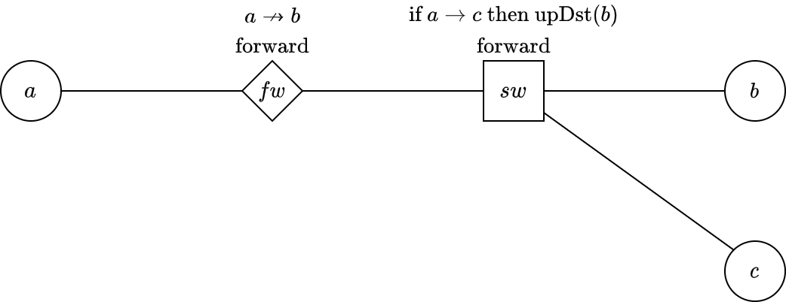
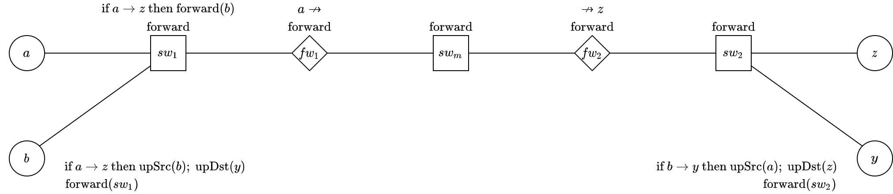
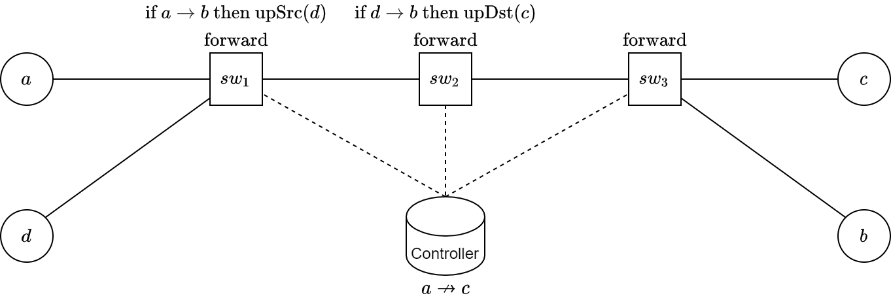

# Formal Semantics Framework for OpenFlow Networks

## Introduction

This project is about using rewriting systems to reason about security conflicts in software defined networks [[1]](#r1).
We utilize Maude [2] to implement the operational semantics in [3],
and leverage the potent model checking tools to detect security conflicts.

## Framework Hierarchy

<div align="center">
    
</div>

## Files

- modules/ : the framework
  - analysis.maude : conflict detecting
  - base.maude : basic data types
  - core.maude : basic units of networks
  - output.maude : obtain output packet
  - semantics.maude : flow rules
- case-1-misc.maude
- case-1.maude
- case-2.maude
- case-3.maude
- debug.maude : some testing codes
- interface.maude : an abstract interface for conflict detecting in a network

### Case 1

A cognitive example taken from [3].

<div align="center">
    
</div>

### Case 2

An example with standalone firewalls.

<div align="center">
    
</div>

### Case 3

A case with centralized controller taken from [4].

<div align="center">
    
</div>

## Dependencies

The entire framework is implemented in Core Maude 3.1 [5].

## Usage

To use the framework, run `Maude`'s interactive interface.

Load any case and manually execute the instructions that are commented out in the file.

```
Maude> load case-2.maude
Maude> rew [t, rf](packet('a, 'z, "SSH", 'a)) .
```

## Reference

<a name="r1"></a>
[1] Nunes, B. A. A., Mendonca, M., Nguyen, X.-N., Obraczka, K., & Turletti, T. (2014). 
A Survey of Software-Defined Networking: Past, Present, and Future of Programmable Networks. 
IEEE Communications Surveys and Tutorials, 16(3), 1617–1634. 
https://doi.org/10.1109/surv.2014.012214.00180

[2] Clavel, M. (2007). 
All About Maude—A High-Performance Logical Framework: How to Specify, Program and Verify Systems in Rewriting Logic. 
Springer Berlin Heidelberg.

[3] Zhao, Y., Wu, X., Liu, J., & Yang, Y. (2018). 
Formal modeling and security analysis for OpenFlow-Based networks. 
2018 23rd International Conference on Engineering of Complex Computer Systems (ICECCS), 201–204. 
https://doi.org/10.1109/ICECCS2018.2018.00032

[4] Zhang, Y., Li, J., Chen, L., Ji, Y., & Tang, F. (2017).
A novel method against the firewall bypass threat in OpenFlow networks. 
2017 9th International Conference on Wireless Communications and Signal Processing (WCSP), 1–6. 
https://doi.org/10.1109/WCSP.2017.8171014

[5] Maude download and installation.
http://maude.cs.illinois.edu/w/index.php/Maude_download_and_installation
